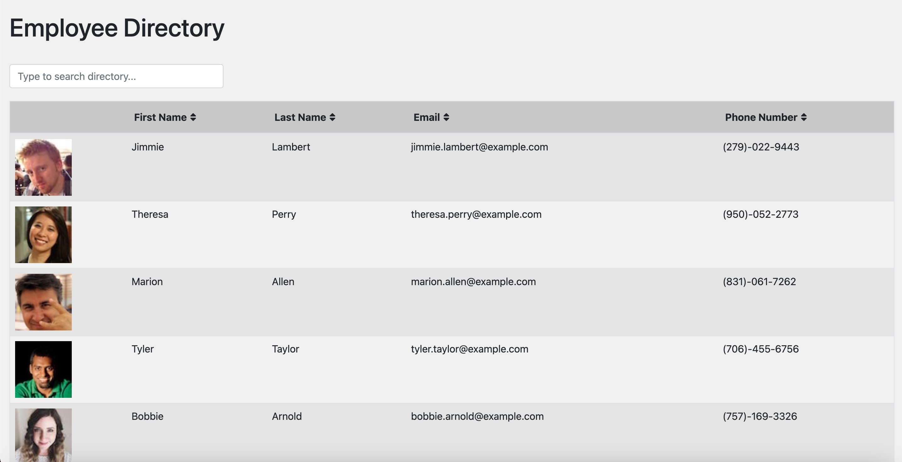
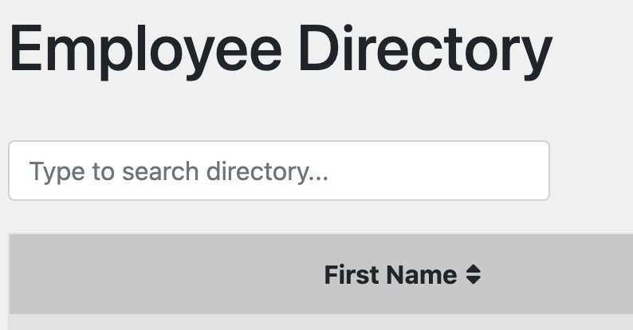

# React Employee Directory




## Description 
This site allows the user to look through a directory of employees.  The user is able to search the directory and sort the directory by each column in the directory table either ascending or descending.  The data for this application is provided by the the [Random User API](https://randomuser.me/).  The directory iself was built using bootstrap classes for style and the react-table npm package for assisted functionality.          

#### Built With
* React.js
* react-table
* Boostrap
* [Random User API](https://randomuser.me/). 

## Table of Contents
  
* [Installation](#installation)
* [Usage](#usage)
* [Questions](#questions)
  
  
## Installation
### View the Project Live <br>


### Run the Project Locally

* Step 1: Navigate to the directory you want to store the project. Clone this your repository to your local computer using the command below. 
```bash
git clone https://github.com/Mark-Mulligan/react-employee-directory.git
```

* Step 2: Use the command line to navigate to the directory that you cloned the project.
Example:
```bash
cd directory/projectdirectory
```

* Step 3: Install the npm package dependencies from the package.json file.
```bash
npm install
```

* Step 4: While in the project directory, run the program using node using the command below. Open you browser and navigate to localhost:3000 to view the application.
```bash
npm start
```  

## Usage 

#### Search Functionality

1.  Simply begin typing in the input and whatever you type will be filtered in the table.  The the filtering is done by all columns so you can search for anything in the table, regardless of column.  



#### Sorting Functionality

1.  Click the arrows next to the column you would like to sort by.  The first time you click, the column will be sorted ascending. The second time you click it will be sorted descending.  Click one more time or anywhere else to disable the sorting.  


## Questions
[My Github](https://github.com/Mark-Mulligan) || mark.mulligan.jr1@gmail.com

#### How to Contact Me
Feel free to reach out to me if you have any questions about this project.  You can email me using the email listed above or can go to my github page to view my other projects and portfolio.

© Mark Mulligan 2021 All Rights Reserved.